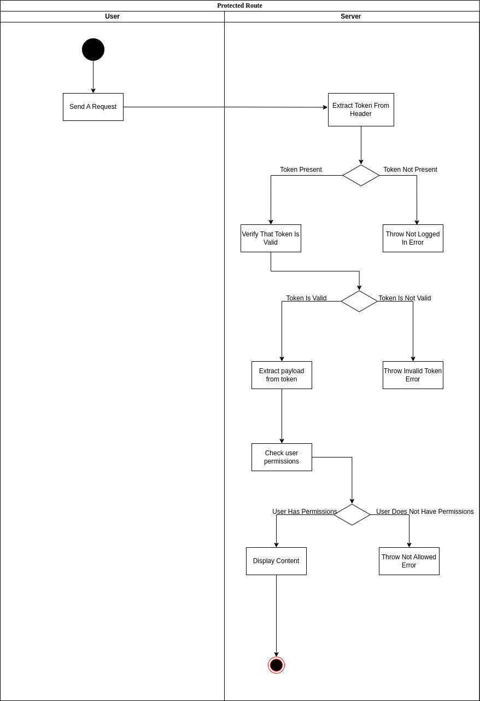

# JWT-With-Node
This is a repo that I use to store the code I use while learning about implementing jwt in node. The goal of this repo is to store code for implementing authorization, authentication and hashing in Express

# Definitions
**Authentication** - The process of confirming that the user is who they say they are e.g if the user attempts to log in as Joe authentication makes sure that the user is actually Joe. This can be done by checking if a provided password or fingerprint matches that stored in the system.

**Authorization** - The process of checking whether a user is allowed to access a certain resource. For example, for a school site authorization comes into play when making sure that only lecturers can change the marks of students or view exams before giving them. *This is done using user roles*.

# Sign Up Flow
The following activities take place at sign up route: 


## Getting Details From Client
To get information from the client we can extract them from the body of the request.
```javascript
router.post('/signup', (req, res) => {
    const {username, email, password} = req.body;
    res.send("POST Request Recieved")
})
```

## Email and Password Validation
Simple validation can be carried out using the *express-validator* package. It gives you middleware functions that you can add to your routes to perform validation. For example, to check if password is at least 8 characters long and that email is written nicely:
```javascript
import {body, validateResult} from 'express-validator'
/// Setting up router
router.post('/signup',
            // Check if req.body.email is a valid email and return error message if not
            body('email', 'Error Message').isEmail(),
            // Check if req.body.password has a minimum length of 8
            body('password', 'Password Should Be Greater Than 8 Characters').isLength({min:8}),
            (req, res) => {
                // Do stuff in route body
            }
);
```

## Check if user exists
You make a request to the database to see if the user already exists. If the user exists an error is thrown. It's good practice to make the error thrown consistent to the errors thrown by express-validator.

## Password Hashing
There are multiple ways to store passwords in a database:
1. **Store the password as plain text**. The issue with this is that if anyone get's access to your database they are able to see all the passwords used by your users.
2. **Encrypt the stored password with a key**. This is better than the previous method but if a hacker were to get the key used to encrypt the system they would basically have access to all passwords in the system
3. **Use a function to hash password**. This is an improvement. The function will allow you to hash the password and to take the hashed password and convert it to plain text. This can be bruteforced though where a hacker can hash a known password and check if the password is in the database.
4. **Use a one way hash**. You cannot get the plain text password from the stored hash
5. **Add salt to password and perform one way hash**. Prepend a postpend a random sequence of strings to the password before hashing it and storing in the system.

To use *Method 5* we use a package called ***bcrypt***. bcrypt allows you to add salt to a password and to hash it.
```javascript
import bcrypt from 'bcrypt'
bcrypt.hash(password, salt) // salt is the number of random letters to add to password before hashing. Recommended value is 10
```

## Storing Details
The hashed password, and the rest of the details are stored in the database

## Sending The JWT
The JWT is the only way for our server to know that the client is who they say they are. It allows the client to log in once and while the token hasn't expired continue to use resources from the server with the server still being sure that the client is who they say they are.
You create JWTs using the *jsonwebtoken* library. The sign() method creates the token and takes 3 arguements **payload, secret and options**
```javascript
import JWT from jsonwebtoken
// Other stuff
const token = JWT.sign(payload, secret, options);
/* 
payload could be an object containing data you need to send to client e.g {
    username: SomeUsername
}
secret is the key you use to identify if JWT was tampered or if it was from your server
options is a dict that contains other options for the token e.g expiresIn which sets how long the token is valid for
*/

// Sending the token
return res.status(200).json({token});
```

# Log In Flow
The log in process will take place as follows


## Send Details From Server
The details from the user are extracted from the body of the request the same way we did it in the sign up workflow

## Get User From Details
We get a user from the database based on details received from client e.g we get the user with the provided email or username. **If no user exists with given details** we return an invalid credentials error. We don't create a more specific error because it might give clues to potential hackers. **If the user exists** we move to the next step.

## Compare stored password to provided password
We can use *bcrypt* to compare the passwords
```javascript
bcrypt.compare(plain_text_password, hashed_password).then(data => {
    // If data is true then they are the same
    if(data) {
        // Send JWT Token
    } else {
        // Throw Error
    }
})
```

## Send JWT Token
Send token in the same way done for sign up route

# Authorization Flow
This checks if you are allowed to access resources.
If you want anybody to be able to acces a resource then you don't need to do any checks i.e just send data
If you want somebody to have logged in you check if they have the token in their request header. To do this we can use middleware functions.


## Extract Token From Header
When the request is received from the client you extract the cookie. The token is stored in the header in a key of the programmers choosing but it is often something similar to x-auth-token or bearer-token
```javascript
const token = req.header('x-auth-token');

// Returns an error if token does not exist
if(!token) {
    return res.status(400).json({message:"Token Does Not Exist"});
}
```

## Verify Token
Verify if the token is valid. This can be done using the *verify* method of jsonwebtokens package. The method returns the payload of the token as an object
```javascript
const payload = JWT.verify(token, secret);

// You can append data from the payload that is needed for authorization in the request
req.authenticated = true;
req.usefulinfo = payload.usefulinfo;
```

# Check User Permissions
Using data from the payload of the token you can check if the user is authorized to access the resource. The function that does it can be its own custom middleware that is provided the role to check for
```javascript
// We wrap the middleware in another function so as to allow it to use the passed role
function checkIfAuthorized(role) {
    return (req, res, next) => {
        // Use data from token to check if user is authorized

        // You can add that user is authorized in request
        req.authorized = true;
    }
}